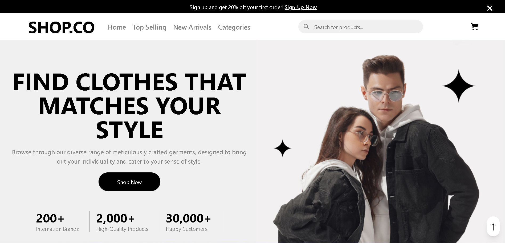

# 🛒 Shop.Co – E-Commerce Website

A sleek, modern, and fully responsive e-commerce website built using **HTML**, **CSS**, and **JavaScript**.
Shop.Co delivers a smooth user experience with product exploration, detailed item pages, interactive cart functionality, and a clean checkout flow.

---

## 🚀 Features

* 🏠 **Homepage:** Hero section, featured collections, and CTAs
* 🛍️ **Category & Product Listings:** Organized product displays
* 🔍 **Product Detail Pages:** High-quality images, descriptions, and pricing
* 🛒 **Shopping Cart:** Add, update, and remove items with real-time feedback
* 💳 **Billing & Checkout:** Simple and clean checkout page
* 📱 **Responsive Design:** Optimized for desktop, tablet, and mobile
* 🎨 **Custom UI:** Minimalist look with clean CSS styling

---

## 📁 Project Structure

```
Shop.Co-E-Commerce-Website/
├── assets/                  # Image and media files
├── inspirations/            # Reference UI/UX design screenshots
├── src/                     # (Optional) Additional source files
├── billing.js
├── billingAndCheckout.html
├── cart.html
├── cart.js
├── categoriesPage.html
├── categoryPage.js
├── customStyles.css
├── index.html               # Main homepage
├── package.json
├── productDetail.html
├── productDetail.js
├── script.js
├── README.md
└── .gitignore
```

---

## 🛠️ Built With

* **HTML** – Semantic markup and structure
* **CSS** – Custom styling and responsive layout
* **JavaScript** – DOM manipulation, interactivity, and cart logic

---

## 💻 Getting Started

To explore and run this project locally:

1. **Clone the repository**

   ```bash
   git clone https://github.com/jalal1122/Shop.Co-E-Commerce-Website.git
   ```

2. **Navigate to the project directory**

   ```bash
   cd Shop.Co-E-Commerce-Website
   ```

3. **Open `index.html` in your browser**
   You can double-click the file or use a live server extension in VS Code.

---

## 📸 UI Preview




---

## 🤝 Contributing

Contributions, improvements, and ideas are welcome!
Feel free to fork the project and submit a pull request.

---

## 📬 Contact

**👨‍💻 Developer:** Muhammad Jalal
📧 Email: [jk4350649@gmail.com](mailto:jk4350649@gmail.com)
🔗 GitHub: [@jalal1122](https://github.com/jalal1122)

---

© 2024 Muhammad Jalal – *Shop.Co E-Commerce Website*
All rights reserved.

---
